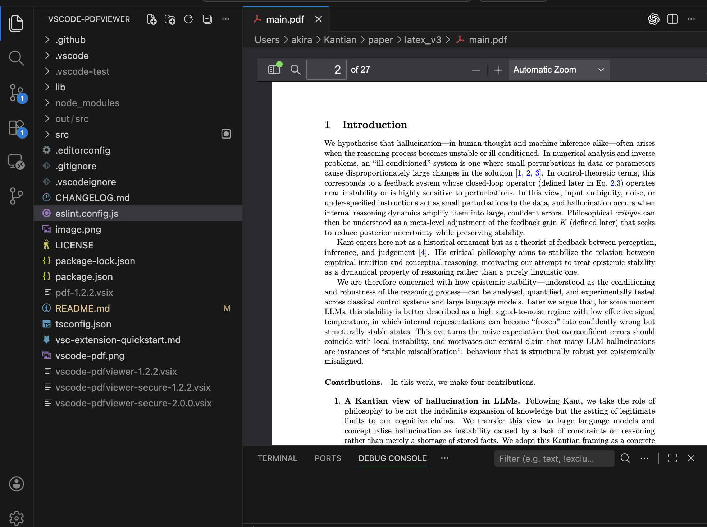

# PDF Viewer Secure

Open and preview PDF files in VS Code with security-first, offline-first defaults.

- View PDF files without leaving VS Code
- Read-only by default
- External links, forms, printing, downloads, and annotation editing stay off unless you enable them
- Built for security-first, offline-first use in business environments

## Release Channels

- Stable releases publish from `vX.Y.Z` tags to the normal Marketplace channel.
- Daily releases build and publish to the Marketplace pre-release channel every day.
- Stable versioning follows normal semver, for example `1.2.3 -> 1.2.4`.
- Daily versioning uses the next minor line with the GitHub run number, for example `1.2.3 -> 1.3.<run_number>`.

## Disclaimer

This extension is provided `as is`, without warranty.
Please review it in your own environment before business or production use.

## Attribution

This project is based on `tomoki1207/vscode-pdfviewer` and uses Mozilla PDF.js.
Original license notices and attribution are preserved in this repository.
